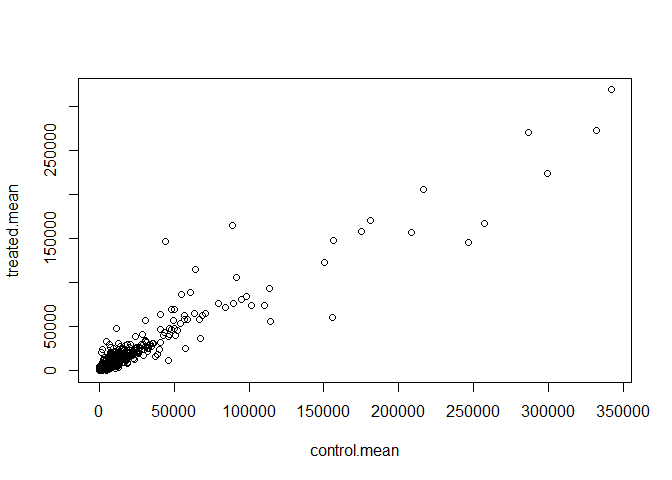
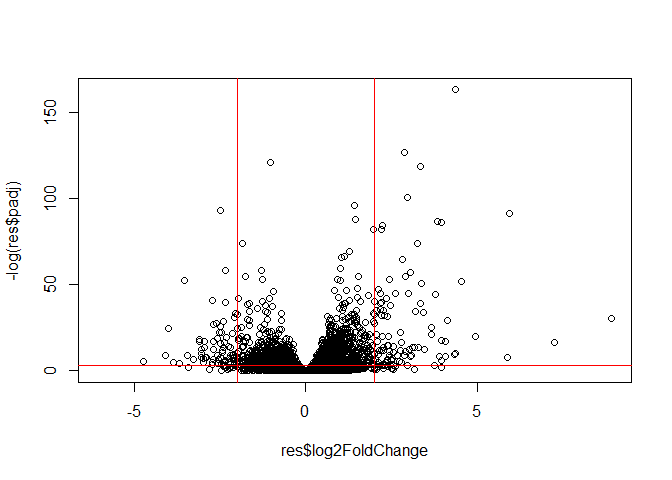
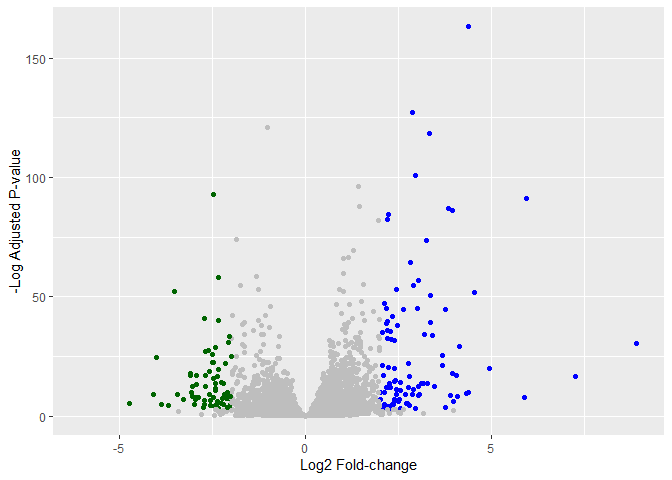

# Class 13: Transcriptomics and the analysis of RNA-Seq data
Kyle Canturia (A17502778)

## Background

Today we’re going to perform an RNASeq analysis of the effects of a
common steroid on airway cells.

Specifically, dexamethasone (referred to as “dex” from now on) on
different airway smooth muscle cell lines (ASM cells).

## Data Import

We need two different inputs:

- **countData**: dataset with genes in rows and experiements in columns
- **colData**: meta data that describes the columns in countData

``` r
counts <- read.csv("airway_scaledcounts.csv", row.names=1)
metadata <-  read.csv("airway_metadata.csv")
```

Looking at counts and metadata

``` r
head(counts)
```

                    SRR1039508 SRR1039509 SRR1039512 SRR1039513 SRR1039516
    ENSG00000000003        723        486        904        445       1170
    ENSG00000000005          0          0          0          0          0
    ENSG00000000419        467        523        616        371        582
    ENSG00000000457        347        258        364        237        318
    ENSG00000000460         96         81         73         66        118
    ENSG00000000938          0          0          1          0          2
                    SRR1039517 SRR1039520 SRR1039521
    ENSG00000000003       1097        806        604
    ENSG00000000005          0          0          0
    ENSG00000000419        781        417        509
    ENSG00000000457        447        330        324
    ENSG00000000460         94        102         74
    ENSG00000000938          0          0          0

``` r
metadata
```

              id     dex celltype     geo_id
    1 SRR1039508 control   N61311 GSM1275862
    2 SRR1039509 treated   N61311 GSM1275863
    3 SRR1039512 control  N052611 GSM1275866
    4 SRR1039513 treated  N052611 GSM1275867
    5 SRR1039516 control  N080611 GSM1275870
    6 SRR1039517 treated  N080611 GSM1275871
    7 SRR1039520 control  N061011 GSM1275874
    8 SRR1039521 treated  N061011 GSM1275875

> Q1. How many genes are in this dataset?

``` r
nrow(counts)
```

    [1] 38694

There are 38694 genes in this dataset.

> Q2. How many ‘control’ cell lines do we have?

``` r
table(metadata$dex)
```


    control treated 
          4       4 

There are 4 control cell lines.

## Differential gene expression

There are 4 replicate drug treated and control (no drug)
columns/experiments in our `counts` object.

We want to find one “mean” value for each gene (rows) in “treated”
(drug) and one mean value for each gene in “control” columns.

Step 1: Find and sort all the “control” columns in `counts` Step 2:
Extract these columns to a new object – `control.counts` Step 3:
Calculate the mean value for each gene

Step 1:

``` r
library(dplyr)
```


    Attaching package: 'dplyr'

    The following objects are masked from 'package:stats':

        filter, lag

    The following objects are masked from 'package:base':

        intersect, setdiff, setequal, union

``` r
metadata %>%
  filter(dex == "control")
```

              id     dex celltype     geo_id
    1 SRR1039508 control   N61311 GSM1275862
    2 SRR1039512 control  N052611 GSM1275866
    3 SRR1039516 control  N080611 GSM1275870
    4 SRR1039520 control  N061011 GSM1275874

``` r
control.inds <- metadata$dex == "control"
```

Step 2:

``` r
control.counts <- counts[ , control.inds]
```

Step 3:

``` r
control.mean <- rowMeans(control.counts)
```

> Q3. How would you make the above code in either approach more robust?
> Is there a function that could help here?

A way to make the code more robust is to not hardcode 4. You could use
ncol() on control.counts to sum up the number of controlled entries in
place of 4, so if more samples are added the code would not need to be
changed.

> Q4. Follow the same procedure for the treated samples (i.e. calculate
> the mean per gene across drug treated samples and assign to a labeled
> vector called treated.mean)

Let’s do the same for the “treated” columns:

Step 1:

``` r
treated.inds <- metadata$dex == "treated"
```

Step 2:

``` r
treated.counts <- counts[ , treated.inds]
```

Step 3:

``` r
treated.mean <- rowMeans(treated.counts)
```

For organization, we will combine the means as `meancounts`

``` r
meancounts <- data.frame(control.mean, treated.mean)
```

> Q5 (a). Create a scatter plot showing the mean of the treated samples
> against the mean of the control samples.

``` r
plot(meancounts)
```



> Q6. Try plotting both axes on a log scale. What is the argument to
> plot() that allows you to do this?

The argument to plot() is “log=xy”.

Due to being highly skewed, the data would benefit from a log
transformation:

``` r
plot(meancounts, log="xy")
```

    Warning in xy.coords(x, y, xlabel, ylabel, log): 15032 x values <= 0 omitted
    from logarithmic plot

    Warning in xy.coords(x, y, xlabel, ylabel, log): 15281 y values <= 0 omitted
    from logarithmic plot


> Q5 (b).You could also use the ggplot2 package to make this figure
> producing the plot below. What geom\_?() function would you use for
> this plot?

``` r
library(ggplot2)
ggplot(meancounts) +
  aes(control.mean, treated.mean) +
  geom_point()
```


You would use geom_point().

**N.B.** We most often use log2 for this type of data as it makes the
interpretation of it easier and more straightforward.

Treated/Control is called “fold-change”

If there was no change we would have a log2-fc of 0

``` r
log2(10/10)
```

    [1] 0

If we had double the amount of transcript around we would have a log2-fc
of 1:

``` r
log2(20/10)
```

    [1] 1

If we had half as much transcripts around we would have a log2-fc of -1:

``` r
log2(5/10)
```

    [1] -1

> Q. Calculate a log 2 fc value for all of our genes and add it as a new
> column to our `meancounts` object

``` r
meancounts$log2fc <- log2(meancounts$treated.mean/meancounts$control.mean)

head(meancounts)
```

                    control.mean treated.mean      log2fc
    ENSG00000000003       900.75       658.00 -0.45303916
    ENSG00000000005         0.00         0.00         NaN
    ENSG00000000419       520.50       546.00  0.06900279
    ENSG00000000457       339.75       316.50 -0.10226805
    ENSG00000000460        97.25        78.75 -0.30441833
    ENSG00000000938         0.75         0.00        -Inf

``` r
zero.vals <- which(meancounts[,1:2]==0, arr.ind=TRUE)

to.rm <- unique(zero.vals[,1])
mycounts <- meancounts[-to.rm,]
head(mycounts)
```

                    control.mean treated.mean      log2fc
    ENSG00000000003       900.75       658.00 -0.45303916
    ENSG00000000419       520.50       546.00  0.06900279
    ENSG00000000457       339.75       316.50 -0.10226805
    ENSG00000000460        97.25        78.75 -0.30441833
    ENSG00000000971      5219.00      6687.50  0.35769358
    ENSG00000001036      2327.00      1785.75 -0.38194109

> Q7. What is the purpose of the arr.ind argument in the which()
> function call above? Why would we then take the first column of the
> output and need to call the unique() function?

arr.ind returns where both the row and column index is true for the
condition set, which is where genes have a value of 0. The reason for
calling unique() is to make sure genes that have a value of 0 for both
control.mean and treated.mean are not counted twice. Lastly, the reason
for taking the first column of the output is because the most important
thing from this is which genes do not have a value of 0, so by removing
the whole column and therefore the whole gene, the dataset is cleared of
those genes with a value of 0.

``` r
up.ind <- mycounts$log2fc > 2
down.ind <- mycounts$log2fc < (-2)
sum(up.ind)
```

    [1] 250

``` r
sum(down.ind)
```

    [1] 367

> Q8. Using the up.ind vector above can you determine how many up
> regulated genes we have at the greater than 2 fc level?

There are 250 upregulated genes.

> Q9. Using the down.ind vector above can you determine how many down
> regulated genes we have at the greater than 2 fc level?

There are 367 downregulated genes.

> Q10. Do you trust these results? Why or why not?

I do not trust these results because fold change can vary widely while
they are not statistically significant. Until a p-value is obtained the
fold changes, even if large, do not necessarily indicate statistical
significance making further analysis to obtain p-values necessary to
make any statements on the trustworthiness of the data.

## DESeq analysis

Let’s do this analysis with an estimate of statistical significance
using the **DESeq2** package.

``` r
library(DESeq2)
```

DESeq2, similar to other bioconductor packages, wants input data in a
specific way.

``` r
dds <- DESeqDataSetFromMatrix(countData = counts, colData = metadata, design = ~dex)
```

    converting counts to integer mode

    Warning in DESeqDataSet(se, design = design, ignoreRank): some variables in
    design formula are characters, converting to factors

### Run the DESeq analysis pipeline

The main function `DESeq()`

``` r
dds <- DESeq(dds)
```

    estimating size factors

    estimating dispersions

    gene-wise dispersion estimates

    mean-dispersion relationship

    final dispersion estimates

    fitting model and testing

``` r
res <- results(dds)
head(res)
```

    log2 fold change (MLE): dex treated vs control 
    Wald test p-value: dex treated vs control 
    DataFrame with 6 rows and 6 columns
                      baseMean log2FoldChange     lfcSE      stat    pvalue
                     <numeric>      <numeric> <numeric> <numeric> <numeric>
    ENSG00000000003 747.194195     -0.3507030  0.168246 -2.084470 0.0371175
    ENSG00000000005   0.000000             NA        NA        NA        NA
    ENSG00000000419 520.134160      0.2061078  0.101059  2.039475 0.0414026
    ENSG00000000457 322.664844      0.0245269  0.145145  0.168982 0.8658106
    ENSG00000000460  87.682625     -0.1471420  0.257007 -0.572521 0.5669691
    ENSG00000000938   0.319167     -1.7322890  3.493601 -0.495846 0.6200029
                         padj
                    <numeric>
    ENSG00000000003  0.163035
    ENSG00000000005        NA
    ENSG00000000419  0.176032
    ENSG00000000457  0.961694
    ENSG00000000460  0.815849
    ENSG00000000938        NA

## Volcano Plot

This is a main summary of results figure, commonly used in these kinds
of studies. It plots log2 fold-change vs (adjusted) p-value.

``` r
plot(res$log2FoldChange,res$padj)
```


Again this y-axis is highly skewed and needs to be log transformed. We
can flip the y-axis with a minus sign in front to match typical graph
conventions.

``` r
plot(res$log2FoldChange, -log(res$padj))
abline(v=-2, col="red")
abline(v=2, col="red")
abline(h=-log(0.05), col="red")
```



### Adding some color anotation

Start with a defauly base color “gray”

``` r
#setting the colors
mycols <- rep("gray", nrow(res))
mycols[ res$log2FoldChange >2 ] <- "blue"
mycols[ res$log2FoldChange < -2 ] <- "darkgreen"
mycols[ res$padj >= 0.05 ] <- "gray"

#making the plot
plot(res$log2FoldChange,
     -log(res$padj),
     col=mycols)

#adding dashed lines representing cutoffs
abline(v=c(-2, 2), lty=2)
abline(h=-log(0.05), lty=2)
```


> Q. Make a presentation quality ggplot version of the previous plot.
> Include clear axis labels, a clean theme, your custom colors, cut-off
> lines and a plot title.

``` r
library(ggplot2)

ggplot(res) +
  aes(res$log2FoldChange, -log(res$padj)) +
  geom_point(col=mycols) +
  labs(x= "Log2 Fold-change",
       y="-Log Adjusted P-value") 
```

    Warning: Removed 23549 rows containing missing values or values outside the scale range
    (`geom_point()`).



## Saving our results

Write a CSV file

``` r
write.csv(res, file="results.csv")
```

## Add Annotation Data

We need to add missing annotation data to our main `res` results object
that we created earlier. It includes the common gene “symbol”

``` r
head(res)
```

    log2 fold change (MLE): dex treated vs control 
    Wald test p-value: dex treated vs control 
    DataFrame with 6 rows and 6 columns
                      baseMean log2FoldChange     lfcSE      stat    pvalue
                     <numeric>      <numeric> <numeric> <numeric> <numeric>
    ENSG00000000003 747.194195     -0.3507030  0.168246 -2.084470 0.0371175
    ENSG00000000005   0.000000             NA        NA        NA        NA
    ENSG00000000419 520.134160      0.2061078  0.101059  2.039475 0.0414026
    ENSG00000000457 322.664844      0.0245269  0.145145  0.168982 0.8658106
    ENSG00000000460  87.682625     -0.1471420  0.257007 -0.572521 0.5669691
    ENSG00000000938   0.319167     -1.7322890  3.493601 -0.495846 0.6200029
                         padj
                    <numeric>
    ENSG00000000003  0.163035
    ENSG00000000005        NA
    ENSG00000000419  0.176032
    ENSG00000000457  0.961694
    ENSG00000000460  0.815849
    ENSG00000000938        NA

We are going to use R and bioconductor to do this “ID mapping”

``` r
library("AnnotationDbi")
```


    Attaching package: 'AnnotationDbi'

    The following object is masked from 'package:dplyr':

        select

``` r
library("org.Hs.eg.db")
```

What databases can we use for translation/mapping?

``` r
columns(org.Hs.eg.db)
```

     [1] "ACCNUM"       "ALIAS"        "ENSEMBL"      "ENSEMBLPROT"  "ENSEMBLTRANS"
     [6] "ENTREZID"     "ENZYME"       "EVIDENCE"     "EVIDENCEALL"  "GENENAME"    
    [11] "GENETYPE"     "GO"           "GOALL"        "IPI"          "MAP"         
    [16] "OMIM"         "ONTOLOGY"     "ONTOLOGYALL"  "PATH"         "PFAM"        
    [21] "PMID"         "PROSITE"      "REFSEQ"       "SYMBOL"       "UCSCKG"      
    [26] "UNIPROT"     

We can use the `mapIds()` function now to translate between databases

``` r
res$symbol <- mapIds(org.Hs.eg.db,
       keys=row.names(res), # Our genenames
       keytype="ENSEMBL",  # their format
       column="SYMBOL")   # desired format
```

    'select()' returned 1:many mapping between keys and columns

> Q. Also add “ENTREZID”, “GENENAME” IDs to `res`

``` r
res$entrez <- mapIds(org.Hs.eg.db,
       keys=row.names(res), 
       keytype="ENSEMBL",  
       column="ENTREZID")   
```

    'select()' returned 1:many mapping between keys and columns

``` r
res$genename <- mapIds(org.Hs.eg.db,
       keys=row.names(res), 
       keytype="ENSEMBL",  
       column="GENENAME") 
```

    'select()' returned 1:many mapping between keys and columns

``` r
head(res)
```

    log2 fold change (MLE): dex treated vs control 
    Wald test p-value: dex treated vs control 
    DataFrame with 6 rows and 9 columns
                      baseMean log2FoldChange     lfcSE      stat    pvalue
                     <numeric>      <numeric> <numeric> <numeric> <numeric>
    ENSG00000000003 747.194195     -0.3507030  0.168246 -2.084470 0.0371175
    ENSG00000000005   0.000000             NA        NA        NA        NA
    ENSG00000000419 520.134160      0.2061078  0.101059  2.039475 0.0414026
    ENSG00000000457 322.664844      0.0245269  0.145145  0.168982 0.8658106
    ENSG00000000460  87.682625     -0.1471420  0.257007 -0.572521 0.5669691
    ENSG00000000938   0.319167     -1.7322890  3.493601 -0.495846 0.6200029
                         padj      symbol      entrez               genename
                    <numeric> <character> <character>            <character>
    ENSG00000000003  0.163035      TSPAN6        7105          tetraspanin 6
    ENSG00000000005        NA        TNMD       64102            tenomodulin
    ENSG00000000419  0.176032        DPM1        8813 dolichyl-phosphate m..
    ENSG00000000457  0.961694       SCYL3       57147 SCY1 like pseudokina..
    ENSG00000000460  0.815849       FIRRM       55732 FIGNL1 interacting r..
    ENSG00000000938        NA         FGR        2268 FGR proto-oncogene, ..

## Save annotated results to a CSV file

``` r
write.csv(res, file="results_annotated.csv")
```

## Pathway analysis

What known biological pathways do our differentially expressed genes
overlap with (play a role in)?

There are many bioconductor packages that can do this kind of analysis

We will use one of oldest packages called **gage** along with
**pathview** to render a picture of the pathways

To install use:
`BiocManager::install( c("pathview", "gage", "gageData") )`

``` r
library(pathview)
library(gage)
library(gageData)
```

Looking at what is in `gageData`

``` r
data(kegg.sets.hs)

# Examine the first 2 pathways in this kegg set for humans
head(kegg.sets.hs, 2)
```

    $`hsa00232 Caffeine metabolism`
    [1] "10"   "1544" "1548" "1549" "1553" "7498" "9"   

    $`hsa00983 Drug metabolism - other enzymes`
     [1] "10"     "1066"   "10720"  "10941"  "151531" "1548"   "1549"   "1551"  
     [9] "1553"   "1576"   "1577"   "1806"   "1807"   "1890"   "221223" "2990"  
    [17] "3251"   "3614"   "3615"   "3704"   "51733"  "54490"  "54575"  "54576" 
    [25] "54577"  "54578"  "54579"  "54600"  "54657"  "54658"  "54659"  "54963" 
    [33] "574537" "64816"  "7083"   "7084"   "7172"   "7363"   "7364"   "7365"  
    [41] "7366"   "7367"   "7371"   "7372"   "7378"   "7498"   "79799"  "83549" 
    [49] "8824"   "8833"   "9"      "978"   

The main `gage()` function requires a simple vector as input

``` r
foldchanges <- res$log2FoldChange
names(foldchanges) <-  res$symbol
head(foldchanges)
```

         TSPAN6        TNMD        DPM1       SCYL3       FIRRM         FGR 
    -0.35070302          NA  0.20610777  0.02452695 -0.14714205 -1.73228897 

The KEGG database uses ENTREZ IDs therefore we need our input vector to
use them for **gage**

``` r
names(foldchanges) <- res$entrez
```

Now we can run `gage()`

``` r
# Get the results
keggres = gage(foldchanges, gsets=kegg.sets.hs)
```

Let’s look at what’s in the output object `keggress`

``` r
attributes(keggres)
```

    $names
    [1] "greater" "less"    "stats"  

``` r
# top 3 downregulated pathways that our genes are involved in
head(keggres$less, 3)
```

                                          p.geomean stat.mean        p.val
    hsa05332 Graft-versus-host disease 0.0004250461 -3.473346 0.0004250461
    hsa04940 Type I diabetes mellitus  0.0017820293 -3.002352 0.0017820293
    hsa05310 Asthma                    0.0020045888 -3.009050 0.0020045888
                                            q.val set.size         exp1
    hsa05332 Graft-versus-host disease 0.09053483       40 0.0004250461
    hsa04940 Type I diabetes mellitus  0.14232581       42 0.0017820293
    hsa05310 Asthma                    0.14232581       29 0.0020045888

Using **pathview** function we can render a figure of these pathways
along with annotation for our DEGs

Let’s look at the hsa05310 asthma pathway with DEGs colored up

``` r
pathview(gene.data=foldchanges, pathway.id="hsa05310")
```

    'select()' returned 1:1 mapping between keys and columns

    Info: Working in directory C:/school/bimm143/bimm143_github/Class 13

    Info: Writing image file hsa05310.pathview.png


> Q. Can you render and insert here the pathway figure for graft vs host
> disease and type 1 diabetes?

``` r
#GVH disease
pathview(gene.data=foldchanges, pathway.id="hsa05332")
```

    'select()' returned 1:1 mapping between keys and columns

    Info: Working in directory C:/school/bimm143/bimm143_github/Class 13

    Info: Writing image file hsa05332.pathview.png

``` r
#type 1 diabetes
pathview(gene.data=foldchanges, pathway.id="hsa04940")
```

    'select()' returned 1:1 mapping between keys and columns

    Info: Working in directory C:/school/bimm143/bimm143_github/Class 13

    Info: Writing image file hsa04940.pathview.png


