# Class 7: Machine Learning 1
Kyle Canturia (A17502778)

- [Background](#background)
- [K-means clustering](#k-means-clustering)
- [Hierarchical Clustering](#hierarchical-clustering)
- [Principal Component Analysis
  (PCA)](#principal-component-analysis-pca)
- [Spotting major differences and
  trends](#spotting-major-differences-and-trends)
  - [Heatmap](#heatmap)
- [PCA the rescue](#pca-the-rescue)
- [Digging deeper (variable
  loadings)](#digging-deeper-variable-loadings)

## Background

Today we will begin our exploration of important machine learning
methods with a focus on **clustering** and **dimensionallity
reduction**.

To start testing these methods let’s make up some sample data to cluster
where we know what the answer should be.

``` r
hist(rnorm(3000, mean = 10))
```

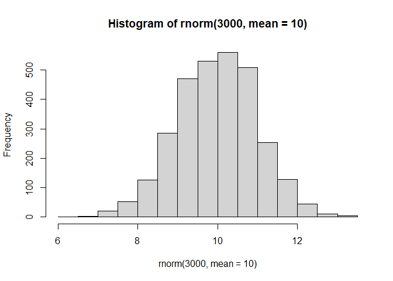

> Q. Can you generate 30 numbers centered at +3 and 30 numbers at -3
> taken at random from a normal distribution.

``` r
tmp <- c(rnorm(30, mean = 3), 
         rnorm(30, mean = -3))

x <- cbind(x=tmp, y=rev(tmp))
plot(x)
```

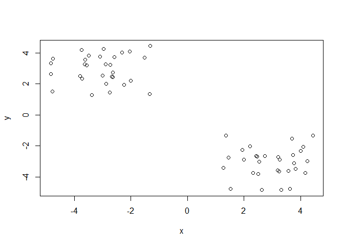

## K-means clustering

The main function in “base R” for K-means clustering is called
`kmeans()`, let’s try it out:

``` r
k <- kmeans(x, centers = 2)
k
```

    K-means clustering with 2 clusters of sizes 30, 30

    Cluster means:
              x         y
    1 -3.058139  2.961751
    2  2.961751 -3.058139

    Clustering vector:
     [1] 2 2 2 2 2 2 2 2 2 2 2 2 2 2 2 2 2 2 2 2 2 2 2 2 2 2 2 2 2 2 1 1 1 1 1 1 1 1
    [39] 1 1 1 1 1 1 1 1 1 1 1 1 1 1 1 1 1 1 1 1 1 1

    Within cluster sum of squares by cluster:
    [1] 52.68442 52.68442
     (between_SS / total_SS =  91.2 %)

    Available components:

    [1] "cluster"      "centers"      "totss"        "withinss"     "tot.withinss"
    [6] "betweenss"    "size"         "iter"         "ifault"      

> Q. What component of your kmeans result object has the cluster
> centers?

``` r
k$centers
```

              x         y
    1 -3.058139  2.961751
    2  2.961751 -3.058139

> Q. What component of your kmeans result object has the cluster size
> (i.e. how many points are in each cluster)?

``` r
k$size
```

    [1] 30 30

> Q. What component of your kmeans result object has the cluster
> membership vector (i.e. the main clustering result: which points are
> in which cluster)?

``` r
k$cluster
```

     [1] 2 2 2 2 2 2 2 2 2 2 2 2 2 2 2 2 2 2 2 2 2 2 2 2 2 2 2 2 2 2 1 1 1 1 1 1 1 1
    [39] 1 1 1 1 1 1 1 1 1 1 1 1 1 1 1 1 1 1 1 1 1 1

> Q. plot the results of clustering (i.e. our data colored by the
> clustering result) along with the cluster centers.

``` r
plot(x, col=k$cluster)
points(k$centers, col="blue", pch=15, ,cex=2)
```

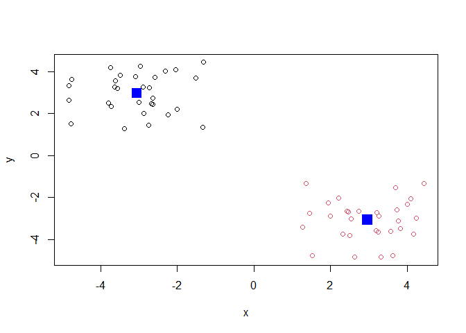

> Q. Can you run `kmeans()` again and cluster `x` into 4 clusters and
> plot the results just like we did above with coloring by cluster and
> the cluster centers shown in blue?

``` r
j <- kmeans(x, centers = 4)
plot(x, col=j$cluster)
points(j$centers, col="blue", pch=15, cex=2)
```

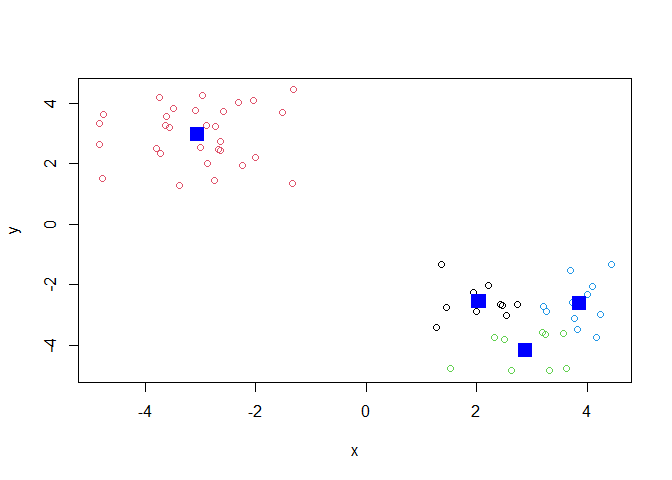

> **Key-point:** Kmeans will always return the clustering that we ask
> for (this is the “K” or “centers” in K-means)!

``` r
k$tot.withinss
```

    [1] 105.3688

## Hierarchical Clustering

The main function for Hierarchical clustering in base R is called
`hclust()`.

One of the main differences with respect to the `kmeans()` function is
that you cannot just pass your input data directly to `hclust()` - it
needs a “distance matrix” as input. We can get this from lot’s of places
including the `dist()` function.

``` r
d <- dist(x)
hc <- hclust(d)
plot(hc)
```

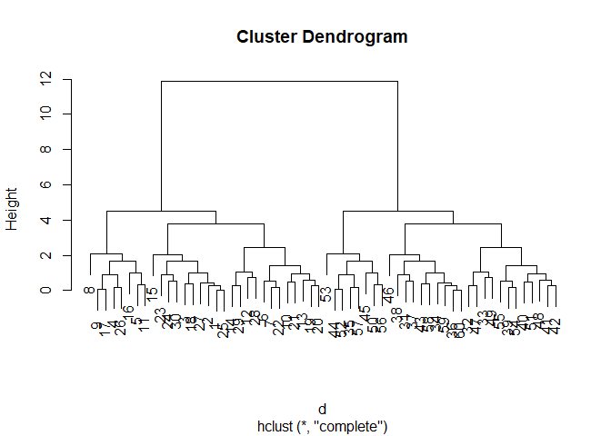

We can “cut” the dendrogram or “tree” at a given height to yield our
“clusters”. For this we use the function `cutree()`

``` r
plot(hc)
abline(h=10, col="red")
```

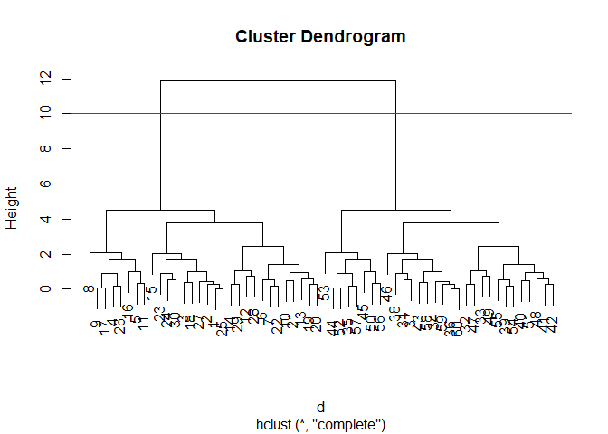

``` r
grps <- cutree(hc, h=10)
```

``` r
grps
```

     [1] 1 1 1 1 1 1 1 1 1 1 1 1 1 1 1 1 1 1 1 1 1 1 1 1 1 1 1 1 1 1 2 2 2 2 2 2 2 2
    [39] 2 2 2 2 2 2 2 2 2 2 2 2 2 2 2 2 2 2 2 2 2 2

> Q. PLot our data `x` colored by the clusterinv result from `hclust()`
> and `cutree()`?

``` r
plot(x, col=grps)
```

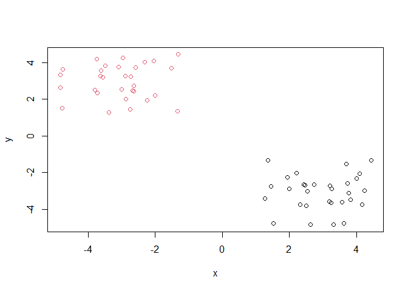

## Principal Component Analysis (PCA)

PCA is a popular dimensionality reduction technique that is widely used
in bioinformatics.

\##PCA of UK food data

Read data on food consumption in the UK

``` r
url <- "https://tinyurl.com/UK-foods"
x <- read.csv(url)
x
```

                         X England Wales Scotland N.Ireland
    1               Cheese     105   103      103        66
    2        Carcass_meat      245   227      242       267
    3          Other_meat      685   803      750       586
    4                 Fish     147   160      122        93
    5       Fats_and_oils      193   235      184       209
    6               Sugars     156   175      147       139
    7      Fresh_potatoes      720   874      566      1033
    8           Fresh_Veg      253   265      171       143
    9           Other_Veg      488   570      418       355
    10 Processed_potatoes      198   203      220       187
    11      Processed_Veg      360   365      337       334
    12        Fresh_fruit     1102  1137      957       674
    13            Cereals     1472  1582     1462      1494
    14           Beverages      57    73       53        47
    15        Soft_drinks     1374  1256     1572      1506
    16   Alcoholic_drinks      375   475      458       135
    17      Confectionery       54    64       62        41

It looks like the row names are not set properly. We can fix this.

``` r
rownames(x) <-  x[,1]
x <- x[,-1]
x
```

                        England Wales Scotland N.Ireland
    Cheese                  105   103      103        66
    Carcass_meat            245   227      242       267
    Other_meat              685   803      750       586
    Fish                    147   160      122        93
    Fats_and_oils           193   235      184       209
    Sugars                  156   175      147       139
    Fresh_potatoes          720   874      566      1033
    Fresh_Veg               253   265      171       143
    Other_Veg               488   570      418       355
    Processed_potatoes      198   203      220       187
    Processed_Veg           360   365      337       334
    Fresh_fruit            1102  1137      957       674
    Cereals                1472  1582     1462      1494
    Beverages                57    73       53        47
    Soft_drinks            1374  1256     1572      1506
    Alcoholic_drinks        375   475      458       135
    Confectionery            54    64       62        41

A better way to do this is fix the row names assignment at import time:

``` r
x <- read.csv(url, row.names = 1)
x
```

                        England Wales Scotland N.Ireland
    Cheese                  105   103      103        66
    Carcass_meat            245   227      242       267
    Other_meat              685   803      750       586
    Fish                    147   160      122        93
    Fats_and_oils           193   235      184       209
    Sugars                  156   175      147       139
    Fresh_potatoes          720   874      566      1033
    Fresh_Veg               253   265      171       143
    Other_Veg               488   570      418       355
    Processed_potatoes      198   203      220       187
    Processed_Veg           360   365      337       334
    Fresh_fruit            1102  1137      957       674
    Cereals                1472  1582     1462      1494
    Beverages                57    73       53        47
    Soft_drinks            1374  1256     1572      1506
    Alcoholic_drinks        375   475      458       135
    Confectionery            54    64       62        41

> Q1. How many rows and columns are in your new data frame named x? What
> R functions could you use to answer this questions?

``` r
dim(x)
```

    [1] 17  4

``` r
nrow(x)
```

    [1] 17

``` r
ncol(x)
```

    [1] 4

17 rows, 4 columns.

> Q2. Which approach to solving the ‘row-names problem’ mentioned above
> do you prefer and why? Is one approach more robust than another under
> certain circumstances?

I prefer the method we used that fixed the row names assignment at
import time.

## Spotting major differences and trends

> Q3: Changing what optional argument in the above barplot() function
> results in the following plot?

Changing `beside=T` to `beside=F`.

> Q4: Changing what optional argument in the above ggplot() code results
> in a stacked barplot figure?

Changing `position = "dodge"` to `position = "stack"`.

> Q5: We can use the pairs() function to generate all pairwise plots for
> our countries. Can you make sense of the following code and resulting
> figure? What does it mean if a given point lies on the diagonal for a
> given plot?

``` r
pairs(x, col=rainbow(nrow(x)), pch=16)
```


``` r
library(pheatmap)

pheatmap( as.matrix(x) )
```


If a given point lies on the diagonal for a given plot, then the two
countries match in terms of consumption for a given product. The heatmap
shows higher consumption of a product with warmer colors, and lower
consumption with cooler colors.

> Q6: Based on the pairs and heatmap figures, which countries cluster
> together and what does this suggest about their food consumption
> patterns? Can you easily tell what the main differences between N.
> Ireland and the other countries of the UK in terms of this data-set?

For the most part, each country clusters together except for Northern
Ireland reflecting similar food consumption between Scotland, England,
and Wales. It’s a bit hard to tell, but they mainly differ on
consumption of fresh fruit, other meat, and fresh potatoes. It’s
definitely easier to see a mismatch on the pair plot rather than the
heatmap figures, but there is still an observable difference on the
heatmap.

### Heatmap

We can install the `pheatmap` package with the `install.packages()`
command that we used previously. Remember that we always run this in the
console and not a code chunk in our quarto document.

Of all these plot really only the `pairs()` plot was useful. This
however took a bit of work to interpret and will not scale when I am
looking at much bigger datasets.

## PCA the rescue

The main funciton in “base R” for PCA is called `prcomp()`.

``` r
pca <- prcomp(t(x))
summary(pca)
```

    Importance of components:
                                PC1      PC2      PC3       PC4
    Standard deviation     324.1502 212.7478 73.87622 3.176e-14
    Proportion of Variance   0.6744   0.2905  0.03503 0.000e+00
    Cumulative Proportion    0.6744   0.9650  1.00000 1.000e+00

> Q. How much variance is captured in the first PC?

67.4%

> Q. How many PCs do I need to capture at least 90% of the total
> variance in the dataset?

Two PCs capture 96.5% of the total variance.

> Q. Plot our main PCA result. Folks can call this different things
> depending on their field of study e.g. “PC plot”, “ordination plot”,
> “Score plot”, “PC1 vs PC2 plot”…

``` r
attributes(pca)
```

    $names
    [1] "sdev"     "rotation" "center"   "scale"    "x"       

    $class
    [1] "prcomp"

To generate our PCA score plot we want the `pca$x` component of the
result object

``` r
pca$x
```

                     PC1         PC2        PC3           PC4
    England   -144.99315   -2.532999 105.768945 -4.894696e-14
    Wales     -240.52915 -224.646925 -56.475555  5.700024e-13
    Scotland   -91.86934  286.081786 -44.415495 -7.460785e-13
    N.Ireland  477.39164  -58.901862  -4.877895  2.321303e-13

``` r
my_cols <- c("orange", "red", "blue", "darkgreen")
plot(pca$x[,1], pca$x[,2], col=my_cols, pch=16)
```

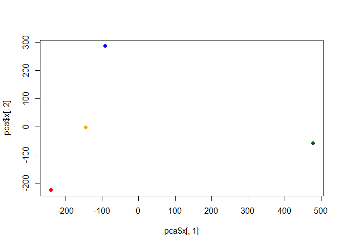

``` r
library(ggplot2)

ggplot(pca$x) +
  aes(PC1, PC2) +
  geom_point(col=my_cols)
```


> Q7: Complete the code below to generate a plot of PC1 vs PC2. The
> second line adds text labels over the data points.

``` r
# Create a data frame for plotting
df <- as.data.frame(pca$x)
df$Country <- rownames(df)

# Plot PC1 vs PC2 with ggplot
ggplot(pca$x) +
  aes(x = PC1, y = PC2, label = rownames(pca$x)) +
  geom_point(size = 3) +
  geom_text(vjust = -0.5) +
  xlim(-270, 500) +
  xlab("PC1") +
  ylab("PC2") +
  theme_bw()
```


> Q8: Customize your plot so that the colors of the country names match
> the colors in our UK and Ireland map and table at start of this
> document.

``` r
# Create a data frame for plotting
df <- as.data.frame(pca$x)
df$Country <- rownames(df)

# Plot PC1 vs PC2 with ggplot
colors <- c(Wales = "red", England = "tan", Scotland = "blue", N.Ireland = "darkgreen")

ggplot(pca$x) +
  aes(x = PC1, y = PC2, label = rownames(pca$x)) +
  geom_point(size = 3) +
  geom_text(color = colors, vjust = -0.5) +
  xlim(-270, 500) +
  xlab("PC1") +
  ylab("PC2") +
  theme_bw() 
```

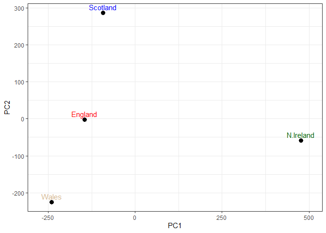

## Digging deeper (variable loadings)

How do the original variables (i.e. the 17 different foods) contribute
to our new PCs?

``` r
ggplot(pca$rotation) +
  aes(x = PC1, 
      y = reorder(rownames(pca$rotation), PC1)) +
  geom_col(fill = "steelblue") +
  xlab("PC1 Loading Score") +
  ylab("") +
  theme_bw() +
  theme(axis.text.y = element_text(size = 9))
```

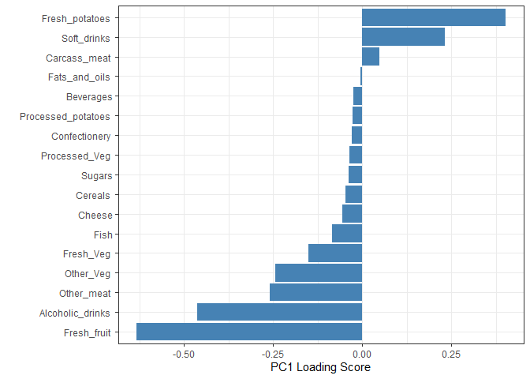

> Q9: Generate a similar ‘loadings plot’ for PC2. What two food groups
> feature prominantely and whoat does PC2 mainly tell us about?

``` r
ggplot(pca$rotation) +
  aes(x = PC2, 
      y = reorder(rownames(pca$rotation), PC2)) +
  geom_col(fill = "steelblue") +
  xlab("PC2 Loading Score") +
  ylab("") +
  theme_bw() +
  theme(axis.text.y = element_text(size = 9))
```

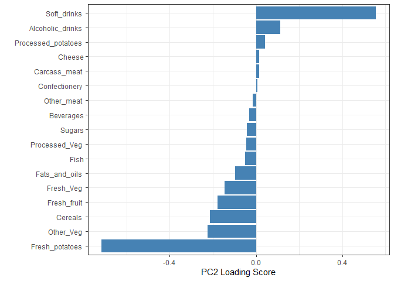

The two food groups that are the most prominent are soft drinks and
alcoholic drinks. PC2 mainly provides information on the second highest
variance in the data, after PC1.
