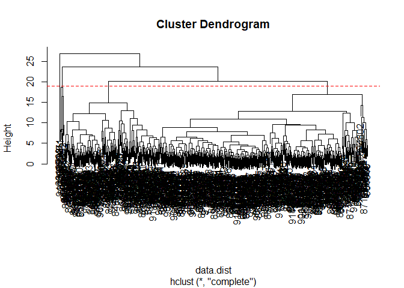
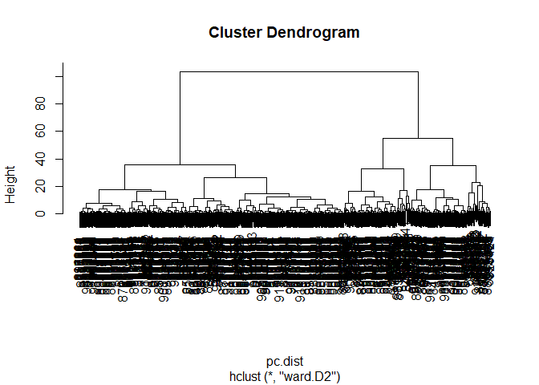
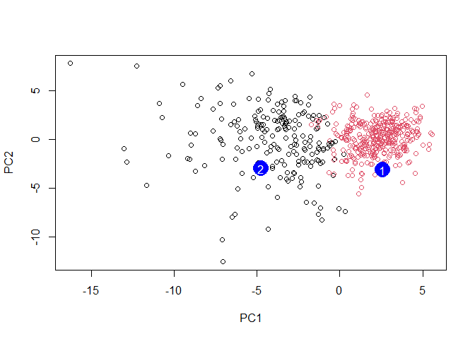

# Class08: Breast Cancer Mini Project
Kyle Canturia (A17502778)

- [Background](#background)
- [Principal Component Analysis](#principal-component-analysis)
- [Interpreting PCA results](#interpreting-pca-results)
- [Communicating PCA results](#communicating-pca-results)
- [Hierarchical Clustering](#hierarchical-clustering)
- [Combining Methods](#combining-methods)
- [Prediction](#prediction)

## Background

In today’s class we will apply the methods and techniques clustering and
PCA to help make sense of a real world breast cancer FNA biopsy data
set.

``` r
fna.data <- "WisconsinCancer.csv"
wisc.df <- read.csv(fna.data, row.names=1)
```

``` r
wisc.data <- wisc.df[,-1]
#removes first column from dataset, we don't want to use this for machine learning models, instead will use it later to compare results to the expert diagnosis
```

``` r
diagnosis <- wisc.df$diagnosis
#stores diagnosis column from original dataset in variable "diagnosis"
```

> Q1: How many observations are in this dataset?

``` r
View(wisc.data)
```

There are 569 observations in this dataset.

> Q2: How many of the observations have a malignant diagnosis?

``` r
table(wisc.df$diagnosis)
```


      B   M 
    357 212 

``` r
sum(wisc.df$diagnosis == "M")
```

    [1] 212

``` r
table(wisc.df$diagnosis == "M")
```


    FALSE  TRUE 
      357   212 

There are 212 observations with a malignant diagnosis.

> Q3: How many variables/features in the data are suffixed with \_mean?

``` r
sum(grepl("_mean$", colnames(wisc.data)))
```

    [1] 10

``` r
#either works
length(grep("_mean", colnames(wisc.data)))
```

    [1] 10

There are 10 observations that are suffixed with “mean”.

## Principal Component Analysis

The main function here is `prcomp()` and we want to make sure we set the
optional argument `scale=TRUE`:

``` r
wisc.pr <- prcomp(wisc.data, scale = T)
summary(wisc.pr)
```

    Importance of components:
                              PC1    PC2     PC3     PC4     PC5     PC6     PC7
    Standard deviation     3.6444 2.3857 1.67867 1.40735 1.28403 1.09880 0.82172
    Proportion of Variance 0.4427 0.1897 0.09393 0.06602 0.05496 0.04025 0.02251
    Cumulative Proportion  0.4427 0.6324 0.72636 0.79239 0.84734 0.88759 0.91010
                               PC8    PC9    PC10   PC11    PC12    PC13    PC14
    Standard deviation     0.69037 0.6457 0.59219 0.5421 0.51104 0.49128 0.39624
    Proportion of Variance 0.01589 0.0139 0.01169 0.0098 0.00871 0.00805 0.00523
    Cumulative Proportion  0.92598 0.9399 0.95157 0.9614 0.97007 0.97812 0.98335
                              PC15    PC16    PC17    PC18    PC19    PC20   PC21
    Standard deviation     0.30681 0.28260 0.24372 0.22939 0.22244 0.17652 0.1731
    Proportion of Variance 0.00314 0.00266 0.00198 0.00175 0.00165 0.00104 0.0010
    Cumulative Proportion  0.98649 0.98915 0.99113 0.99288 0.99453 0.99557 0.9966
                              PC22    PC23   PC24    PC25    PC26    PC27    PC28
    Standard deviation     0.16565 0.15602 0.1344 0.12442 0.09043 0.08307 0.03987
    Proportion of Variance 0.00091 0.00081 0.0006 0.00052 0.00027 0.00023 0.00005
    Cumulative Proportion  0.99749 0.99830 0.9989 0.99942 0.99969 0.99992 0.99997
                              PC29    PC30
    Standard deviation     0.02736 0.01153
    Proportion of Variance 0.00002 0.00000
    Cumulative Proportion  1.00000 1.00000

> Q4: What proportion of orginal variance is captured by the first
> principal component (PC1)?

44.27% of the original variance is captured by PC1.

> Q5: How many principal components (PCs) are required to describe at
> least 70% of the original variance in the data?

It takes 3 PCs to describe at least 70% of the original variance.

> Q6: How many principal components are required to describe at least
> 90% of the original variance in the data?

It takes 7 PCs to describe at least 90% of the original variance.

## Interpreting PCA results

> Q7: What stands out about this plot? Is it easy or difficult to
> understand and why?

``` r
biplot(wisc.pr)
```


The main thing that stands out about this plot is that all the clusters
are all really close together. This density makes the plot difficult to
understand as it’s hardd to pick out individual clusters.

Our main PCA “score plot” or “PC plot” of results:

``` r
library(ggplot2)
```

``` r
ggplot(wisc.pr$x) +
  aes(PC1,PC2, col=diagnosis) +
  geom_point()
```


> Q8: Generate a similar plot for PCs 1 and 3, what do you notice about
> these plots?

``` r
ggplot(wisc.pr$x) +
  aes(PC1, PC3, col=diagnosis) +
  geom_point()
```


I noticed that in this plot, PC1 appears to be flipped relative to the
x-plane and is now upside down compared to the first plot. I notice that
in both plots, there’s still a pretty clear distinction between
diagnosis “B” and “M”.

## Communicating PCA results

> Q9: For the first principal component, what is the main component of
> the loading vector (i.e. wisc.pr\$rotation\[,1\]) for the feature
> concave.points_mean? This tells us how much this original feature
> contributes to the first PC. Are there any features with larger
> contributions than this one?

## Hierarchical Clustering

> Q10: What is the height at which the clustering model has 4 clusters?

``` r
data.scaled <- scale(wisc.data)
```

``` r
data.dist <- dist(data.scaled)
```

``` r
wisc.hclust <- hclust(data.dist, method = "complete")
```

``` r
plot(wisc.hclust)
abline(h = 19, col="red", lty=2)
```



The clustering model has 4 clusters at a height of 19.

``` r
wisc.hclust.clusters <- cutree(wisc.hclust,k=4)
```

``` r
table(wisc.hclust.clusters, diagnosis)
```

                        diagnosis
    wisc.hclust.clusters   B   M
                       1  12 165
                       2   2   5
                       3 343  40
                       4   0   2

``` r
table(wisc.hclust.clusters)
```

    wisc.hclust.clusters
      1   2   3   4 
    177   7 383   2 

> Q12: Which method gives your favorite results for the same data.dist
> dataset? Explain your reasoning.

I believe that the `ward.D2` method gives the best results for the same
dataset. The other methods connect clusters based on distance, while
`ward.D2` groups based on minimizing the variance within a cluster. This
helps to dampen some of the noise, which is especially helpful with such
a large dataset.

## Combining Methods

Here we will take our PCA resuluts and use those an input for
clustering. In other words our `wisc.pr$x` scores that we plotted above
(the main output from PCA - how the data lie on our new principal
component axis/variables) and use a subset of the PCs that capture the
most variance as input for `hclust()`.

``` r
pc.dist <- dist(wisc.pr$x[,1:3])
wisc.pr.hclust <- hclust(pc.dist, method = "ward.D2")
plot(wisc.pr.hclust)
```



Cut the dendrogram/tree into two main groups/clusters:

``` r
grps <- cutree(wisc.pr.hclust, k=2)
table(grps)
```

    grps
      1   2 
    203 366 

``` r
table(grps, diagnosis)
```

        diagnosis
    grps   B   M
       1  24 179
       2 333  33

I want to know how clustering in `grps` with values of 1 or 2 correspond
to the expert `diagnosis`

``` r
table(grps, diagnosis)
```

        diagnosis
    grps   B   M
       1  24 179
       2 333  33

My clustering **groups 1** are mostly “M” diagnosis (179) and my
clustering **group 2** are mostly “B” diagnosis (333)

24 FP 179 TP 333 TN 33 FN

## Prediction

``` r
#url <- "new_samples.csv"
url <- "https://tinyurl.com/new-samples-CSV"
new <- read.csv(url)
npc <- predict(wisc.pr, newdata=new)
npc
```

               PC1       PC2        PC3        PC4       PC5        PC6        PC7
    [1,]  2.576616 -3.135913  1.3990492 -0.7631950  2.781648 -0.8150185 -0.3959098
    [2,] -4.754928 -3.009033 -0.1660946 -0.6052952 -1.140698 -1.2189945  0.8193031
                PC8       PC9       PC10      PC11      PC12      PC13     PC14
    [1,] -0.2307350 0.1029569 -0.9272861 0.3411457  0.375921 0.1610764 1.187882
    [2,] -0.3307423 0.5281896 -0.4855301 0.7173233 -1.185917 0.5893856 0.303029
              PC15       PC16        PC17        PC18        PC19       PC20
    [1,] 0.3216974 -0.1743616 -0.07875393 -0.11207028 -0.08802955 -0.2495216
    [2,] 0.1299153  0.1448061 -0.40509706  0.06565549  0.25591230 -0.4289500
               PC21       PC22       PC23       PC24        PC25         PC26
    [1,]  0.1228233 0.09358453 0.08347651  0.1223396  0.02124121  0.078884581
    [2,] -0.1224776 0.01732146 0.06316631 -0.2338618 -0.20755948 -0.009833238
                 PC27        PC28         PC29         PC30
    [1,]  0.220199544 -0.02946023 -0.015620933  0.005269029
    [2,] -0.001134152  0.09638361  0.002795349 -0.019015820

``` r
plot(wisc.pr$x[,1:2], col=grps)
points(npc[,1], npc[,2], col="blue", pch=16, cex=3)
text(npc[,1], npc[,2], c(1,2), col="white")
```



``` r
wisc.pr.hclust.clusters <- cutree(wisc.pr.hclust, k=2)
```

``` r
table(wisc.pr.hclust.clusters, diagnosis)
```

                           diagnosis
    wisc.pr.hclust.clusters   B   M
                          1  24 179
                          2 333  33

> Q13: How well does the newly created `hclust` model with two clusters
> separate out the two “M” and “B” diagnoses?

It does well, there is a clear majority of either diagnosis between each
cluster with only a small minority of the other diagnosis.

> Q14: How well do the hierarchical clustering models you created in the
> previous sections (i.e. without first doing PCA) do in terms of
> separating the diagnoses?

``` r
table(wisc.hclust.clusters, diagnosis)
```

                        diagnosis
    wisc.hclust.clusters   B   M
                       1  12 165
                       2   2   5
                       3 343  40
                       4   0   2

They do not do as well for separating the diagnoses, there are multiple
clusters instead of 2 clear clusters which have a single diagnosis
dominating them.

> Q16: Which patient should be prioritized for follow up based on the
> results?

Patient 2 should be prioritized for follow up based on the results as
they reflect a malignant diagnosis
