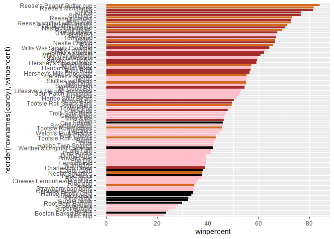
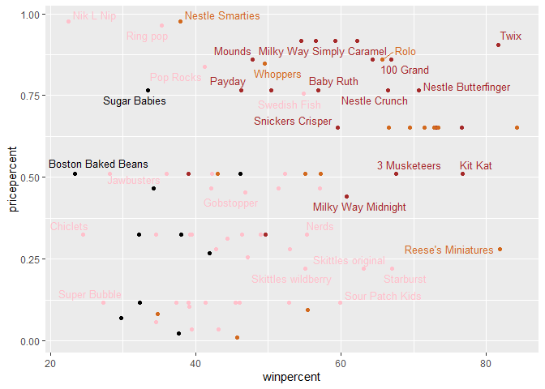

# Class09
Kyle Canturia (A17502778)

- [Importing Candy Data](#importing-candy-data)
- [Exploratory Analysis](#exploratory-analysis)
- [Overall Candy Rankings](#overall-candy-rankings)
- [Taking a look at pricepercent](#taking-a-look-at-pricepercent)
- [Exploring the correlation
  structure](#exploring-the-correlation-structure)
- [Principal Component Analysis](#principal-component-analysis)

## Importing Candy Data

``` r
candy_file <- "candy-data.csv"
candy = read.csv(candy_file, row.names=1)
head(candy)
```

                 chocolate fruity caramel peanutyalmondy nougat crispedricewafer
    100 Grand            1      0       1              0      0                1
    3 Musketeers         1      0       0              0      1                0
    One dime             0      0       0              0      0                0
    One quarter          0      0       0              0      0                0
    Air Heads            0      1       0              0      0                0
    Almond Joy           1      0       0              1      0                0
                 hard bar pluribus sugarpercent pricepercent winpercent
    100 Grand       0   1        0        0.732        0.860   66.97173
    3 Musketeers    0   1        0        0.604        0.511   67.60294
    One dime        0   0        0        0.011        0.116   32.26109
    One quarter     0   0        0        0.011        0.511   46.11650
    Air Heads       0   0        0        0.906        0.511   52.34146
    Almond Joy      0   1        0        0.465        0.767   50.34755

> Q1. How many different candy types are in this dataset?

There are 9 different candy types in this dataset (chocolate, fruity,
etc.).

> Q2. How many fruity candy types are in the dataset?

``` r
sum(candy$fruity)
```

    [1] 38

There are 38 fruity candy types in the dataset.

``` r
candy["Twix", ]$winpercent
```

    [1] 81.64291

``` r
library(dplyr)
```


    Attaching package: 'dplyr'

    The following objects are masked from 'package:stats':

        filter, lag

    The following objects are masked from 'package:base':

        intersect, setdiff, setequal, union

``` r
candy |> 
  filter(row.names(candy)=="Twix") |> 
  select(winpercent)
```

         winpercent
    Twix   81.64291

> Q3. What is your favorite candy (other than Twix) in the dataset and
> what is it’s winpercent value?

``` r
candy["Fun Dip", ]$winpercent
```

    [1] 39.1855

Fundip – 39.18%

> Q4. What is the winpercent value for “Kit Kat”?

``` r
candy["Kit Kat", ]$winpercent
```

    [1] 76.7686

Kit Kat’s winpercent value is 76.76%

> Q5. What is the winpercent value for “Tootsie Roll Snack Bars”?

``` r
candy["Tootsie Roll Snack Bars", ]$winpercent
```

    [1] 49.6535

49.65% is the Tootsie Roll snack bar winpercent value.

``` r
library("skimr")
skim(candy)
```

|                                                  |       |
|:-------------------------------------------------|:------|
| Name                                             | candy |
| Number of rows                                   | 85    |
| Number of columns                                | 12    |
| \_\_\_\_\_\_\_\_\_\_\_\_\_\_\_\_\_\_\_\_\_\_\_   |       |
| Column type frequency:                           |       |
| numeric                                          | 12    |
| \_\_\_\_\_\_\_\_\_\_\_\_\_\_\_\_\_\_\_\_\_\_\_\_ |       |
| Group variables                                  | None  |

Data summary

**Variable type: numeric**

| skim_variable | n_missing | complete_rate | mean | sd | p0 | p25 | p50 | p75 | p100 | hist |
|:---|---:|---:|---:|---:|---:|---:|---:|---:|---:|:---|
| chocolate | 0 | 1 | 0.44 | 0.50 | 0.00 | 0.00 | 0.00 | 1.00 | 1.00 | ▇▁▁▁▆ |
| fruity | 0 | 1 | 0.45 | 0.50 | 0.00 | 0.00 | 0.00 | 1.00 | 1.00 | ▇▁▁▁▆ |
| caramel | 0 | 1 | 0.16 | 0.37 | 0.00 | 0.00 | 0.00 | 0.00 | 1.00 | ▇▁▁▁▂ |
| peanutyalmondy | 0 | 1 | 0.16 | 0.37 | 0.00 | 0.00 | 0.00 | 0.00 | 1.00 | ▇▁▁▁▂ |
| nougat | 0 | 1 | 0.08 | 0.28 | 0.00 | 0.00 | 0.00 | 0.00 | 1.00 | ▇▁▁▁▁ |
| crispedricewafer | 0 | 1 | 0.08 | 0.28 | 0.00 | 0.00 | 0.00 | 0.00 | 1.00 | ▇▁▁▁▁ |
| hard | 0 | 1 | 0.18 | 0.38 | 0.00 | 0.00 | 0.00 | 0.00 | 1.00 | ▇▁▁▁▂ |
| bar | 0 | 1 | 0.25 | 0.43 | 0.00 | 0.00 | 0.00 | 0.00 | 1.00 | ▇▁▁▁▂ |
| pluribus | 0 | 1 | 0.52 | 0.50 | 0.00 | 0.00 | 1.00 | 1.00 | 1.00 | ▇▁▁▁▇ |
| sugarpercent | 0 | 1 | 0.48 | 0.28 | 0.01 | 0.22 | 0.47 | 0.73 | 0.99 | ▇▇▇▇▆ |
| pricepercent | 0 | 1 | 0.47 | 0.29 | 0.01 | 0.26 | 0.47 | 0.65 | 0.98 | ▇▇▇▇▆ |
| winpercent | 0 | 1 | 50.32 | 14.71 | 22.45 | 39.14 | 47.83 | 59.86 | 84.18 | ▃▇▆▅▂ |

> Q6. Is there any variable/column that looks to be on a different scale
> to the majority of the other columns in the dataset?

Chocolate and fruity appear to be on a different scale, out of all the
candy types they have “1” at p75 which the other types don’t have.

> Q7. What do you think a zero and one represent for the
> candy\$chocolate column?

I think they represent whether a candy contains chocolate or not, with 1
meaning there’s chocolate in the candy and 0 meaning there’s no
chocolate.

## Exploratory Analysis

> Q8. Plot a histogram of winpercent values using both base R an
> ggplot2.

``` r
hist(candy$winpercent)
```


``` r
library(ggplot2)

ggplot(candy,(aes(winpercent))) +
  geom_histogram()
```

    `stat_bin()` using `bins = 30`. Pick better value `binwidth`.


> Q9. Is the distribution of winpercent values symmetrical?

No, the distribution is slightly skewed to the left centered around the
40-45% winpercent value.

> Q10. Is the center of the distribution above or below 50%?

The center of the distribution is below 50%.

> Q11. On average is chocolate candy higher or lower ranked than fruit
> candy?

``` r
average_chocolate <- (mean(candy$winpercent[as.logical(candy$chocolate)]))
average_chocolate
```

    [1] 60.92153

``` r
average_fruity <- (mean(candy$winpercent[as.logical(candy$fruity)]))
average_fruity
```

    [1] 44.11974

On average, chocolate candy is higher ranked than fruit candy (60.92% vs
44.11%).

> Q12. Is this difference statistically significant?

``` r
t.test((candy$winpercent[as.logical(candy$chocolate)]), (candy$winpercent[as.logical(candy$fruity)]))
```


        Welch Two Sample t-test

    data:  (candy$winpercent[as.logical(candy$chocolate)]) and (candy$winpercent[as.logical(candy$fruity)])
    t = 6.2582, df = 68.882, p-value = 2.871e-08
    alternative hypothesis: true difference in means is not equal to 0
    95 percent confidence interval:
     11.44563 22.15795
    sample estimates:
    mean of x mean of y 
     60.92153  44.11974 

This difference is statistically significant due to the p-value being
below the 0.05 threshold.

## Overall Candy Rankings

> Q13. What are the five least liked candy types in this set?

``` r
candy |> arrange(winpercent) |> head(5)
```

                       chocolate fruity caramel peanutyalmondy nougat
    Nik L Nip                  0      1       0              0      0
    Boston Baked Beans         0      0       0              1      0
    Chiclets                   0      1       0              0      0
    Super Bubble               0      1       0              0      0
    Jawbusters                 0      1       0              0      0
                       crispedricewafer hard bar pluribus sugarpercent pricepercent
    Nik L Nip                         0    0   0        1        0.197        0.976
    Boston Baked Beans                0    0   0        1        0.313        0.511
    Chiclets                          0    0   0        1        0.046        0.325
    Super Bubble                      0    0   0        0        0.162        0.116
    Jawbusters                        0    1   0        1        0.093        0.511
                       winpercent
    Nik L Nip            22.44534
    Boston Baked Beans   23.41782
    Chiclets             24.52499
    Super Bubble         27.30386
    Jawbusters           28.12744

The 5 least like candy types are Nik L Nip, Boston Baked Beans,
Chiclets, Super Bubble, and Jawbusters.

> Q14. What are the top 5 all time favorite candy types out of this set?

``` r
candy |> arrange(desc(winpercent)) |> head(5)
```

                              chocolate fruity caramel peanutyalmondy nougat
    Reese's Peanut Butter cup         1      0       0              1      0
    Reese's Miniatures                1      0       0              1      0
    Twix                              1      0       1              0      0
    Kit Kat                           1      0       0              0      0
    Snickers                          1      0       1              1      1
                              crispedricewafer hard bar pluribus sugarpercent
    Reese's Peanut Butter cup                0    0   0        0        0.720
    Reese's Miniatures                       0    0   0        0        0.034
    Twix                                     1    0   1        0        0.546
    Kit Kat                                  1    0   1        0        0.313
    Snickers                                 0    0   1        0        0.546
                              pricepercent winpercent
    Reese's Peanut Butter cup        0.651   84.18029
    Reese's Miniatures               0.279   81.86626
    Twix                             0.906   81.64291
    Kit Kat                          0.511   76.76860
    Snickers                         0.651   76.67378

The top 5 candy types are Reese’s Peanut Butter cup, Reeses’s
Minitiatures, Twix, Kit Kat, and Snickers.

> Q15. Make a first barplot of candy ranking based on winpercent values.

``` r
library(ggplot2)

ggplot(candy) +
      aes(winpercent, rownames(candy)) +
      geom_col()
```


> Q16. Use the reorder() function to get the bars sorted by winpercent.

``` r
library(ggplot2)

ggplot(candy) +
      aes(winpercent, reorder(rownames(candy), winpercent)) +
      geom_col()
```


``` r
my_cols=rep("black", nrow(candy))
my_cols[as.logical(candy$chocolate)] = "chocolate"
my_cols[as.logical(candy$bar)] = "brown"
my_cols[as.logical(candy$fruity)] = "pink"
```

``` r
ggplot(candy) + 
  aes(winpercent, reorder(rownames(candy),winpercent)) +
  geom_col(fill=my_cols) 
```



> Q17. What is the worst ranked chocolate candy?

The worst ranked chocolate candy is sixlets. \> Q18. What is the best
ranked fruity candy?

The best ranked fruity candy is starbust.

## Taking a look at pricepercent

``` r
library(ggrepel)

ggplot(candy) +
  aes(winpercent, pricepercent, label=rownames(candy)) +
  geom_point(col=my_cols) + 
  geom_text_repel(col=my_cols, size=3.3, max.overlaps = 5)
```

    Warning: ggrepel: 54 unlabeled data points (too many overlaps). Consider
    increasing max.overlaps



> Q19. Which candy type is the highest ranked in terms of winpercent for
> the least money - i.e. offers the most bang for your buck?

``` r
ord <- order(candy$pricepercent, decreasing = TRUE)
head( candy[ord,c(11,12)], n=5 )
```

                             pricepercent winpercent
    Nik L Nip                       0.976   22.44534
    Nestle Smarties                 0.976   37.88719
    Ring pop                        0.965   35.29076
    Hershey's Krackel               0.918   62.28448
    Hershey's Milk Chocolate        0.918   56.49050

``` r
ratio <- candy$winpercent/candy$pricepercent
ordered <- order(ratio, decreasing = T)
head( candy[ordered,c(11,12)], n=5 )
```

                         pricepercent winpercent
    Tootsie Roll Midgies        0.011   45.73675
    Pixie Sticks                0.023   37.72234
    Fruit Chews                 0.034   43.08892
    Dum Dums                    0.034   39.46056
    Strawberry bon bons         0.058   34.57899

The highest ranked candy type in terms of winpercent for the least money
is Tootsie Roll Midgies.

> Q20. What are the top 5 most expensive candy types in the dataset and
> of these which is the least popular?

The top 5 most expensive candy types are Nik L Nip, Nestle Smarties,
Ring pop, Hershey’s Krackel, and Hershey’s Milk Chocolate. The least
popular out of these is Nik L Nip.

## Exploring the correlation structure

``` r
library(corrplot)
```

    corrplot 0.95 loaded

``` r
cij <- cor(candy)
corrplot(cij)
```


> Q22. Examining this plot what two variables are anti-correlated
> (i.e. have minus values)?

Chocolate and Fruity are anti-correlated.

> Q23. Similarly, what two variables are most positively correlated?

Chocolate and winpercent are the most positively correlated.

## Principal Component Analysis

``` r
pca <- prcomp(candy, scale =T)
summary(pca)
```

    Importance of components:
                              PC1    PC2    PC3     PC4    PC5     PC6     PC7
    Standard deviation     2.0788 1.1378 1.1092 1.07533 0.9518 0.81923 0.81530
    Proportion of Variance 0.3601 0.1079 0.1025 0.09636 0.0755 0.05593 0.05539
    Cumulative Proportion  0.3601 0.4680 0.5705 0.66688 0.7424 0.79830 0.85369
                               PC8     PC9    PC10    PC11    PC12
    Standard deviation     0.74530 0.67824 0.62349 0.43974 0.39760
    Proportion of Variance 0.04629 0.03833 0.03239 0.01611 0.01317
    Cumulative Proportion  0.89998 0.93832 0.97071 0.98683 1.00000

``` r
#plot(pca$x[,1:2])
```

``` r
#plot(pca$x[,1:2], col=my_cols, pch=16)
```

``` r
# Make a new data-frame with our PCA results and candy data
#my_data <- cbind(candy, pca$x[,1:3])
```

``` r
#p <- ggplot(my_data) + 
     #   aes(x=PC1, y=PC2, 
      #      size=winpercent/100,  
      #      text=rownames(my_data),
      #      label=rownames(my_data)) +
      #  geom_point(col=my_cols)

#p
```

``` r
#library(ggrepel)

#p + geom_text_repel(size=3.3, col=my_cols, max.overlaps = 7)  + 
#  theme(legend.position = "none") +
 # labs(title="Halloween Candy PCA Space",
    #   subtitle="Colored by type: chocolate bar (dark brown), chocolate #other (light brown), fruity (red), other (black)",
      # caption="Data from 538")
```

``` r
#library(plotly)
#ggplotly(p)
```

> Q24. Complete the code to generate the loadings plot above. What
> original variables are picked up strongly by PC1 in the positive
> direction? Do these make sense to you? Where did you see this
> relationship highlighted previously?

No answer.

> Q25. Based on your exploratory analysis, correlation findings, and PCA
> results, what combination of characteristics appears to make a
> “winning” candy? How do these different analyses (visualization,
> correlation, PCA) support or complement each other in reaching this
> conclusion?

No answer.

I had a hard time getting this to render, I put a hashtag before some
lines of code to disable them.
