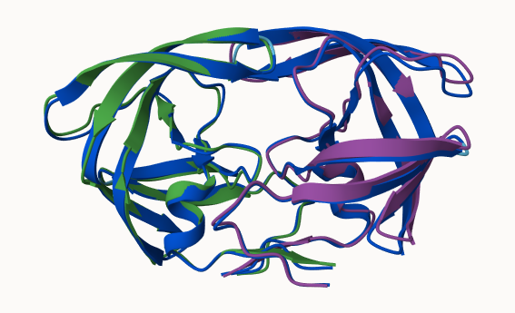
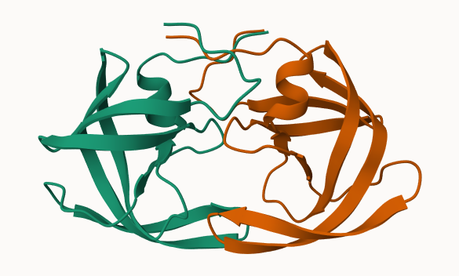

## Background

We saw last class that the main repository for biomolecular structure (PDB database) only has ~250,000 entries.

UnitProtKB (the main protein seqence database) has over 200 million entries!

## Alphafold

In this hands-on session we will utilize AlphaFold to predict protein structure from sequence (Jumper et al. 2021).

Without the aid of such approaches, it can take years of expensive laboratory work to determine the structure of just one protein. With AlphaFold we can now accurately compute a typical protein structure in as little as ten minutes.

## The EBI Alphafold database

The EBI Alphafold database contains lots of computed structure models. It is increasingly likely that the structure you  are interested in is already in this database at <https://alphafold.ebi.ac.uk/>

There are 3 major outputs from AlphaFold

1. A model of structure in **PDB** format
2. A **pLDDT score**: that tells us how confident the model is for a given residue in your proein (High values are better, above 70)
3. a **PAE score** that tells us about protein packing quality

If you can't find a matching entry for the sequence you are interested in AFDB you can run AlphaFold yourself...

## Running AlphaFold

We will use ColabFold to run AlphaFold on our sequence < https://github.com/sokrypton/ColabFold

 

##Interpreting Results

We can read all the AlphaFold results into R and do more quantitative analysis than just viewing the structures in Molstar:

Read all the PDB models:
```{r}
library(bio3d)
p <- read.pdb("hivpr_23119.result/hivpr_23119/hivpr_23119_unrelaxed_rank_001_alphafold2_multimer_v3_model_2_seed_000.pdb")
```

```{r}
pdb_files <- list.files("hivpr_23119.result/hivpr_23119/", pattern = ".pdb", full.names = T)
pdbs <- pdbaln(pdb_files, fit=TRUE, exefile="msa")
```

```{r}
#library(bio3dview)
#view.pdbs(pdbs)
```

How similar or different are my models?

```{r}
rd <- rmsd(pdbs) 

library(pheatmap)
colnames(rd) <- paste0("m",1:5)
rownames(rd) <- paste0("m",1:5)
pheatmap(rd)
```
Left off here from class. 

Plotting pLDDT values across the modles:

```{r}
pdb <- read.pdb("1hsg")
plotb3(pdbs$b[1,], typ="l", lwd=2, sse=pdb)
points(pdbs$b[2,], typ="l", col="red")
points(pdbs$b[3,], typ="l", col="blue")
points(pdbs$b[4,], typ="l", col="darkgreen")
points(pdbs$b[5,], typ="l", col="orange")
abline(v=100, col="gray")
```

Using core.find() function to find the most consistent rigid core which is common between the models, which can be used to improve the fitting of the models. 

```{r}
core <- core.find(pdbs)
core.inds <- print(core, vol=0.5)
xyz <- pdbfit(pdbs, core.inds, outpath="corefit_structures")
```

```{r}
rf <- rmsf(xyz)

plotb3(rf, sse=pdb)
abline(v=100, col="gray", ylab="RMSF")
```
From the model, the first chain varies a lot between models while the second chain varies. 

## Predicted Alignment Error for domains

```{r}
results_dir <- "hivpr_23119/" 
library(jsonlite)
pae_files <- list.files(path=results_dir,
                        pattern=".*model.*\\.json",
                        full.names = TRUE) ## reads and lists json files within the results directory and assigns it to pae_files
```

```{r}
pae1 <- read_json(pae_files[1],simplifyVector = TRUE)
pae5 <- read_json(pae_files[5],simplifyVector = TRUE)
attributes(pae1)
```

```{r}
head(pae1$plddt) ##gives per residue plddt scores
```

Plotting residue by residue PAE scores:

```{r}
plot.dmat(pae1$pae, 
          xlab="Residue Position (i)",
          ylab="Residue Position (j)")
```

```{r}
plot.dmat(pae5$pae, 
          xlab="Residue Position (i)",
          ylab="Residue Position (j)",
          grid.col = "black",
          zlim=c(0,30)) ##plot for model 5
```

```{r}
plot.dmat(pae1$pae, 
          xlab="Residue Position (i)",
          ylab="Residue Position (j)",
          grid.col = "black",
          zlim=c(0,30)) ##plot for model 1
```

## Residue conservation from alignment file

```{r}
aln_file <- list.files(path=results_dir,
                       pattern=".a3m$",
                        full.names = TRUE)
aln_file
```

```{r}
aln <- read.fasta(aln_file[1], to.upper = TRUE)
```

```{r}
dim(aln$ali) ##returns number of sequences in the alignment
```

Score residue conservation in the alignment using conserv():

```{r}
sim <- conserv(aln)
plotb3(sim[1:99], sse=trim.pdb(pdb, chain="A"),
       ylab="Conservation Score")
```

Residues 25-28 have the highest conservation score, we can generate a consensus sequence with a high cutoff value to eliminate other residues with a smaller score:

```{r}
con <- consensus(aln, cutoff = 0.9)
con$seq
```

```{r}
m1.pdb <- read.pdb(pdb_files[1])
occ <- vec2resno(c(sim[1:99], sim[1:99]), m1.pdb$atom$resno)
write.pdb(m1.pdb, o=occ, file="m1_conserv.pdb")
```


