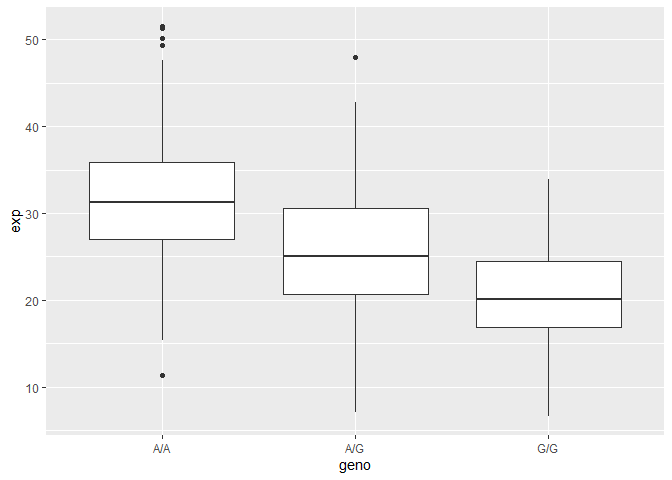

# Class 12 Pt. 2
Kyle Canturia (A17502778)

# Section 1: Identify genetic variants of interest

Downloaded data from Ensembl as a csv file

``` r
mxl <- read.csv("373531-SampleGenotypes-Homo_sapiens_Variation_Sample_rs8067378.csv")
head(mxl)
```

      Sample..Male.Female.Unknown. Genotype..forward.strand. Population.s. Father
    1                  NA19648 (F)                       A|A ALL, AMR, MXL      -
    2                  NA19649 (M)                       G|G ALL, AMR, MXL      -
    3                  NA19651 (F)                       A|A ALL, AMR, MXL      -
    4                  NA19652 (M)                       G|G ALL, AMR, MXL      -
    5                  NA19654 (F)                       G|G ALL, AMR, MXL      -
    6                  NA19655 (M)                       A|G ALL, AMR, MXL      -
      Mother
    1      -
    2      -
    3      -
    4      -
    5      -
    6      -

``` r
table(mxl$Genotype..forward.strand.)
```


    A|A A|G G|A G|G 
     22  21  12   9 

GBR dataset

``` r
gbr <- read.csv("373522-SampleGenotypes-Homo_sapiens_Variation_Sample_rs8067378.csv")
head(gbr)
```

      Sample..Male.Female.Unknown. Genotype..forward.strand. Population.s. Father
    1                  HG00096 (M)                       A|A ALL, EUR, GBR      -
    2                  HG00097 (F)                       G|A ALL, EUR, GBR      -
    3                  HG00099 (F)                       G|G ALL, EUR, GBR      -
    4                  HG00100 (F)                       A|A ALL, EUR, GBR      -
    5                  HG00101 (M)                       A|A ALL, EUR, GBR      -
    6                  HG00102 (F)                       A|A ALL, EUR, GBR      -
      Mother
    1      -
    2      -
    3      -
    4      -
    5      -
    6      -

# Section 4: Population Scale Analysis

``` r
pop <- read.table("rs8067378_ENSG00000172057.6.txt")
head(pop)
```

       sample geno      exp
    1 HG00367  A/G 28.96038
    2 NA20768  A/G 20.24449
    3 HG00361  A/A 31.32628
    4 HG00135  A/A 34.11169
    5 NA18870  G/G 18.25141
    6 NA11993  A/A 32.89721

``` r
#reads dataset and assigns it to a variable
```

> Q13: Read this file into R and determine the sample size for each
> genotype and their corresponding median expression levels for each of
> these genotypes.

``` r
table(pop$geno)
```


    A/A A/G G/G 
    108 233 121 

``` r
##only looks at the column "geno" and returns count of how many of each genotype is present
```

Theres 108 A\|A, 233 A\|G, and 121 G\|G.

``` r
library(dplyr) 
```


    Attaching package: 'dplyr'

    The following objects are masked from 'package:stats':

        filter, lag

    The following objects are masked from 'package:base':

        intersect, setdiff, setequal, union

``` r
  pop %>%
  group_by(geno) %>%
  summarize(geno_median = median(exp))
```

    # A tibble: 3 × 2
      geno  geno_median
      <chr>       <dbl>
    1 A/A          31.2
    2 A/G          25.1
    3 G/G          20.1

``` r
##uses dplyr tools to first group the samples by genotype, then summarizes the median of each genotype
```

The median expression levels for A\|A, A\|G, and G\|G are 31.24, 25.06,
and 20.07 respectively.

> Q14: Generate a boxplot with a box per genotype, what could you infer
> from the relative expression value between A/A and G/G displayed in
> this plot? Does the SNP effect the expression of ORMDL3?

``` r
library(ggplot2)
ggplot(pop) + 
  aes(geno, exp) +
  geom_boxplot()
```



``` r
##makes boxplot with geno on the x axis and exp on the y
```

A\|A has the highest expression value while G\|G has the lowest, and
A\|G is in between. From the plot, it’s evident that the SNP is
associated with differing expressions of ORMDL3.
